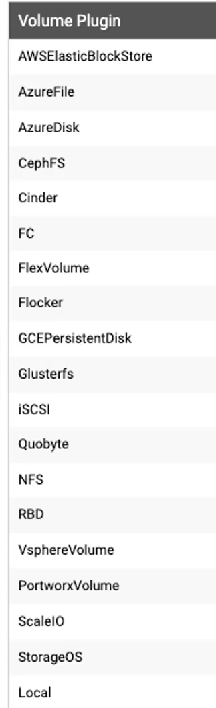

# State Persistence
<hr/><br/><br/>

## Useful commands
```bash
kubectl get persistentvolumes
kubetl get persistentvolumeclaims
kubectl get sc
```

## Volumes and Mounts

### Local Volume per Pod
```bash
kubeclt create -f pod_local_volume.yaml
```

### External Volume per Pod
```bash
kubeclt create -f pod_external_volume.yaml
```

## Persistent Volumes

### Static Provisioning

1 - Create a Persistent Volume
```bash
kubeclt create -f persistent_volume.yaml
```
2 - Create a Persistent Volume Claim
```bash
kubeclt create -f persistent_volume_claim.yaml
```
3a - Create Pod Claiming Persistent Volume
```bash
kubeclt create -f pod_definition_pvc.yaml
```
3b - Create Deployment Claiming Persistent Volume
```bash
kubeclt create -f deployment_pvc.yaml
```

### Dynamic Provisioning

1 - Create a Storage Class
```bash
kubeclt create -f storage_class.yaml
```
2 - Create a Persistent Volume Claim that will be provisioned by the Storage Class
```bash
kubeclt create -f persistent_volume_claim_sc.yaml
```
3a - Create Pod Claiming Persistent Volume
```bash
kubeclt create -f pod_definition_pvc.yaml
```
3b - Create Deployment Claiming Persistent Volume
```bash
kubeclt create -f deployment_pvc.yaml
```

#### Several provisioners
